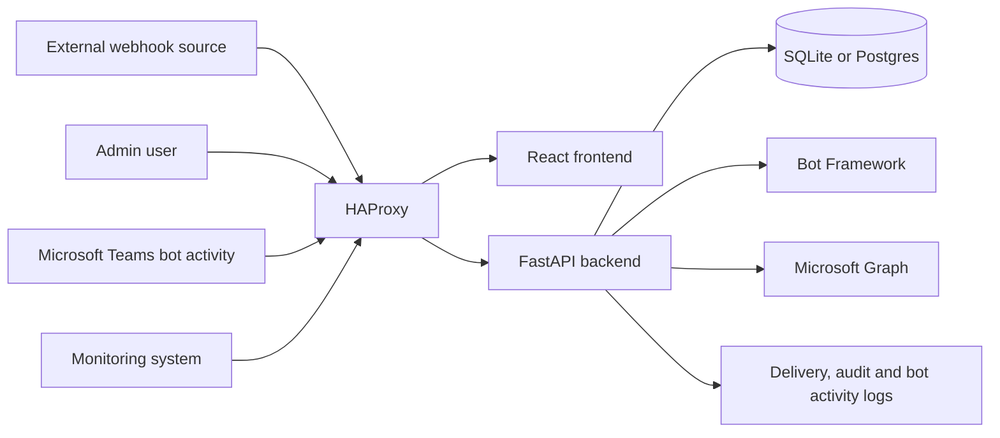

# Architecture

## Overview

Teams Rehook is a webhook relay for Microsoft Teams. External systems post to route-specific relay URLs. The backend validates the route token, normalizes the payload, delivers the message through the configured backend, and stores a delivery event.

The application has four main parts:

- React/Vite frontend served by nginx in Docker.
- FastAPI backend under `backend/app`.
- SQLAlchemy persistence using SQLite locally by default and Postgres in Docker Compose.
- HAProxy routing `/api/*` to the backend and all other paths to the frontend.

## Components

## Request Flow

1. A source system sends a request to `/api/v1/webhooks/{route_token}`.
2. The backend hashes the token and finds the matching route.
3. The backend rejects unknown, inactive, empty, invalid, or oversized requests.
4. The payload is normalized into an internal message shape.
5. The route delivery backend is selected:
   - `bot_framework` sends through Bot Framework to a stored service URL and conversation ID.
   - `graph` sends through Microsoft Graph with a delegated service-user connection.
6. The result is stored as a `webhook_delivery_events` row.
7. Route last-delivery metadata is updated.

## Authentication And Authorization

Admin APIs use session-cookie authentication. Authenticated write requests require `X-CSRF-Token`.

Public or machine endpoints:

- `POST /api/v1/webhooks/{route_token}` uses the route token embedded in the relay URL.
- `POST /api/v1/bot/messages` receives Teams bot activities.
- `GET /api/v1/monitoring/status` requires `Authorization: Bearer <MONITORING_API_KEY>`.
- `GET /api/v1/health` and `GET /api/v1/readyz` are health endpoints.

## Persistence

The backend uses SQLAlchemy models in `backend/app/models.py`. Tables are created and backfilled during startup through `backend/app/seed.py`.

Docker Compose uses Postgres. Direct local backend execution defaults to SQLite at `sqlite:///./app.db`.

See [Data model](data-model.md).

## Microsoft Integrations

### Bot Framework

Bot Framework delivery requires:

- `MS_APP_TENANT_ID`
- `MS_APP_CLIENT_ID`
- `MS_APP_CLIENT_SECRET`
- A valid Teams Bot Framework `service_url`
- A valid `conversation_id`

Teams Rehook captures conversation references from inbound bot activities at `/api/v1/bot/messages`.

### Microsoft Graph Lookup

Graph lookup uses app-only credentials to search users, teams, and channels and to refresh display names. Lookup metadata does not prove sendability.

### Microsoft Graph Delivery

Graph delivery uses a delegated service-user connection and sends to supported Graph targets. Messages appear as the delegated service user.

## Error Handling

The public webhook endpoint records rejected, failed, and delivered attempts as delivery events. Rejections include unknown tokens, disabled routes, invalid payloads, empty payloads, and oversized requests.

Admin readiness endpoints report non-secret diagnostic state. Monitoring output intentionally excludes relay URLs, route tokens, service URLs, conversation IDs, OAuth tokens, secrets, and raw auth responses.

## Security Design Notes

- Relay URLs are secrets.
- Session-changing and admin write APIs require CSRF protection.
- Secret settings are write-only in API responses.
- Settings secrets can be encrypted at rest in `app_settings`.
- Delegated Graph refresh material is stored encrypted and must not be exposed through logs or responses.
- Production deployments should use HTTPS and `SESSION_SECURE_COOKIE=true`.

## Known Technical Limits

- No dedicated migration framework is present; startup code handles table creation and additive/backfill schema maintenance.
- No queue or retry worker is visible in the repository.
- User management is list-only in the current UI.
- Production backup, restore, rollout, rollback, monitoring, and support ownership are TODOs.
